# Laboratory Instrumentation Amplifier with bipolar inputs, 16bit 1MSPS ADC, SPI for Teensy, Arduino

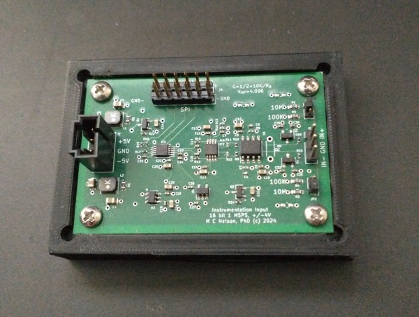

---
### Table of contents
[Introduction](#intro) 
[1. Contents and instructions](#repo) 
[2. Design details](#design) 
[3. Spice model](#spice) 
[4. ADC sampling and timing](#timing) 
[5. Detailed part selection](#parts) 
[6. PCBWay sponsorship and acknowledgement](#ack) 

---
 

## Introduction

Instrumentation amplifiers ("INAs") are important for making sensitive precise stable voltage measurements with very high input impedance and strong noise rejection.
If you do research in the physical sciences or engineering or study electrical phenomena in biological systems, then you have probably used an INA.
They are a cornerstone of traditional instruments such as electrometers, and EKG machines, and laboratory studies in chemical physics, semiconductors, advanced materials, organo- and bio- electronics.

But, if you have used a traditional INA in your research, you may have noticed that they have certain limitations (which we are going to address in this design).
In particular, there is a well known trade-off where precision or sensitivity comes at the expense of some combination of bandwidth and impedance.
INAs are typically low bandwidth devices.
But there are interesting phenomena, for example involving charge processes on microsecond time scales, where high impedance measurements with a fast INA would be an especially useful tool.

This limitation in traditional INAs arises, at least in part, in two properties of amplifier chips; the input voltage noise density en (V/√Hz) and the input current noise density in (A/√Hz).
At a given bandwidth and impedance these contribute to the noise as *v*e,rms ≈ en√f and *v*i,rms ≈ zn in √f.
Note that both have a factor of root frequency but the current noise density is also multiplied by impedance.
We can think of a "noise resistance", Rn = en/in.
When the amplifier input sees an impedance larger than Rn, current noise dominates and noise increases more rapidly with bandwidth.
Low noise with high impedance and bandwidth requires low noise density with high noise resistance, alongside adequate bandwidth and slew.

Let's illustrate this with a numerical example. If we want 16 bit data for a signal of 1V, the noise (rms) should be around 10μV or smaller.
For a bandwidth of 1MHz, we need en ≈ 10nV/√Hz.
And for an impedance of 10Mohm, we need in  ≈ 1fA/√Hz.
That is, we need current noise density in the range of single digit fA/√Hz, or smaller.
It is challenging to find what we need in older INA chips (see [Table 5.8 in H&H AOE 3rd ed.](https://archive.org/details/the-art-of-electronics-3rd-ed-2015_202008/page/363/mode/1up)),
But there *are* newer Op Amps with ~10nV/√Hz and ~1fA/√Hz noise densities, >MHZ bandwidth and >10V/μs slew.
So, this is where a "roll your own" approach can be an advantage over older INA chips.

Another issue in traditional INAs is that they most often have single ended outputs.
The modern paradigm in high performance analog to digital converters (ADC) is increasingly to have differential inputs.
And, there is a large repertoire of high performance fully differential amplifiers (FDA) designed specifically to drive these differential ADCs.
Rather than run a single ended BNC across the lab to an analog input in a crate, nowadays we interface our high performance analog circuit over a short differential path to a high performance ADC co-located on the same board and export an all digital interface to an inexpensive microcontroller board or a computer.
The analog noise is well managed within a small area of the circuit board, and an all differential signal path helps control noise all the way to the ADC with its digital interface.

### About the INA and other contents of this repository:

In this repository we provide cad files and software source codes to make and operate an up-to-date instrumentation amplifier (INA) that can accommodate 10Mohm impedances with 16 bit precision at 1MSPS.
The host interface is a simple convert (CNVST) signal and SPI.
Asserting the "CNVST" line initiates conversion to digital and
after 700 nsecs, with CNVST low, a 16 bit SPI transfer retrieves the data.
The logic level for the SPI and CNVST are per the Vdd pin in the external connector and can be between 1.7V to 5.5V.
The SPI can be clocked as fast as 100MHz.
The INA board must be powered at -5V and +5V.
We provide a dual power supply for this, which we describe later.

We include an Arduino "sketch" (as source code) to operate the INA from a Teensy or Arduino microcontroller (MCU) board, and a Python program to provide an interactive interface to operate the instrument and record and display data in real time from a desktop or laptop computer.
The MCU board appears as a serial device to the computer with human readable commands and responses.
The source code has been compiled for and run on a Teensy 4, an Arduino UNO R4 and a STM32 Nucleo 144 (F7).
We prefer the Teensy for having the best SPI implementation and the fastest USB.

As described below, the basic operation of the device is simple and it should be easy to customize or crib from the source code or python code to integrate the INA into your experiment.

In the following we include some discussion of the design process, especially as related to part selection.
And we provide spice models that may help you check your changes, if you want to make any changes to the design.

For a more thorough discussion of the electrical topics mentioned here, the reader is referred to Horowitz, P., & Hill, W. (2015). The art of electronics (3rd ed.). Cambridge University Press. ISBN-10 0521809266.  Especially see Chapter 5 "Precision Circuits" and Chapter 8 "Low Noise Techniques".

### A word on the Spi Instrumentation Project:

Building instruments is an old tradition in science.  Many of the great advances were by scientists working with instrument makers or who were themselves great instrument makers.  In recent decades there is a different kind of pressure on academic science.  There seems to be less time or interest for learning those kinds of skills, compared to writing proposals to buy equipment.
Consequently doing science has become much more expensive and the sort of science someone gets to do increasingly becomes a function of where they are.
But like many things in nature, science is cyclic, and scientists are resourceful.
With the advent of low cost high performance MCU boards, 3-d printers and low cost CNC machines, there is now a growing community in DIY lab equipment.
But, there is still a roadblock when it comes to some of the more advanced design challenges.
Few are able to build a photon tagging system with picosecond timing from scratch, for example.
Our contribution, as long time instrumentation physicists is to fill in the gap to make higher end capabilities available to this new paradigm.
We believe that combining high end instrumentation circuits with the new generation in Arduino type MCU boards can be a powerful tool that can bring important capabilities to your lab and contribute to truly open science.

There is a sponsor button at the top of this repository.  Please do consider joining with us and contributing to our effort.

### Our sponsor for the INA - [PCBWay](https://www.pcbway.com/) 

We want to express special appreciation to PCBWay for sponsoring assembly of the first INA boards.  I enjoyed working them and we plan to work with PCBWay going forward.  Going back to PCBWay for the next designs and contributing to their community project forum, really is the best kind of praise that I can muster for any vendor.

On that note, we plan to post this design to the PCBWay community forum as our first experiment in this paradigm.  We are eager to see how it works out.

### Obtaining boards:

To obtain boards, the options include ordering a board through PCBWay per the above, or contact me and then click the sponsor button.
The parts cost at Digikey is USD 36 per board at this writing.
Preparing an order still takes a few hours of careful attention since we review everything and check for updates in the BOM each time.
 

 

---

## 1. Contents and Instructions:
In this repo you will find:
<ol type="a">
<li>
KiCad files - for a high performance INA with a 16 bit 1 MSPS ADC that can be used with a Teensy 4.x, UNO R4, Nucleo144 or other Arduino type MCU board.
</li>
<li>
Source code - to operate the INA with any of the above platforms to record voltages and waveforms in single, averaged, clocked or triggered data acquisition modes, implement a set of human readable commands and transfer data over USB.
</li>
<li>
Python code - class library and utility program that runs on a desktop or laptop to operate the INA-MCU, view data in realtime and save data to disk files.
</li>
<li>
SPICE models - in LTSpice for the complete circuit and including a model for the ADC.
</li>
</ol>

### a) Fabrication
In the KiCAD files directory you will find a zip file with gerbers, drill and placement files, and a BOM.  These are easily regenerated from the KiCAD files.  If you are not familiar with ordering PCBs or assembly, the support team at PCBWay will guide you through the process.  Alternatively, you can sponsor a fabrication run and get a board.  Contact me for more information about this.

### b) Controllers
You may want to use the INA with one of our controllers.
Please see our [T4.0 based controller, here](https://github.com/drmcnelson/SPI-Instrumentation-Controller-T4.0)
and our [T4.1 based controller, here](https://github.com/drmcnelson/SPI-Instrumentation-Controller-T4.1).
We recommend these over the R4 and N144 because of the faster processor and faster USB and because of the native 16 bit transfer capability already built into  the Teensy SPI library

### c) Power requirements and recommended power supply
The INA requires a -5V,+5V power supply.
The repo for our [+/-5V instrument power supply is  here](https://github.com/drmcnelson/Dual-pos-neg-5V-Supply-from-USB-power)
The power architecture of the INA assumes the the board is powered by this power supply.
The power supply in turn is normally powered from the filtered +5V power connector provided on the controller although it can alternatively be powered directly from USB

### d) The complete setup with controller and recommended power supply.
The following shows a complete setup with the INA, T4 based controller and power supply.  Notice the power supply is powered by the +5V connector on the controller and then powers the INA.   The INA is connected to the controller by a 12 pin (2x6) ribbon cable.

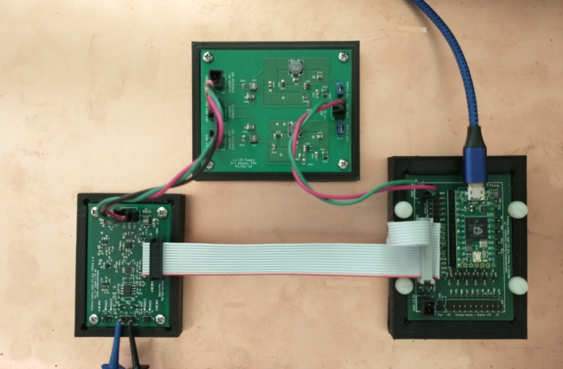

### e) Input range and bandwidth
The range at each side of the differential input is -4V to +4V.
Full scale for the differential signal is therefore 8V.
Spectral response is flat from DC.
There is a low pass filter with time constant at the Nyquist limit for the 1MHz sample rate.

### f) Increasing gain
Gain can be increased by adding the resistor Rg.
There is a thru-hole footprint for this part located between the input header and the first Op Amp chip.
The gain equation is G = 1/2 + 10K/Rg.
Rg = 100 will give you a gain of 100.5.
With a gain of 100, the full scale range on each side of the differential input is effectively 40mV and the full scale differential signal is 80mV.
Larger inputs will clip since the rails for the Op Amps are just a little past -4V and +4V.

### g) Jumpers, selecting input impedance
There are three pin jumpers adjacent to each side of the differential input.
These allow you to select a 10M or 100K shunt to ground.
With no jumper installed the input impedance is that of the non-inverting input of the Op Amp.
It is important to have some path to ground, whether it is through the shunt resistor or the sample, rather than leave the input to drift off to one of the rails.

### h) Thermistor and measurements with voltage divider
You might use the internal 100K shunt with an external 100K thermistor to make accurate temperature measurements, or with an external resistor to form a divider to look at larger voltages.

The setup with a thermistor would look like the following where Vin is a known constant voltage and the internal resistor is selected by the jumpers as described above.  The controller has a high precision voltage reference output that you can use for this.

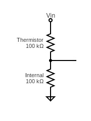

The setup with a divider would look similar to the above, though the external resistance might be considerably larger.
If you use a divider to measure large voltages, be very careful that the resulting voltage at the divider is within 4V.

Keep in mind also that Johnson (thermal) noise density for a resistor is about 0.13√R in units of nV/√Hz.
For a 16 bit precision on ±4V, 1LSB corresponds to 122μV. 
For 1Mohm and 1MHz the Johnson noise is 130uV.
So a 10:1 divider using the internal 100K and a 900K external can be okay.
With larger resistors more bits are used up for noise.
 

### i) Specs
<table style="width:60%;margin-left:30px">

<th>
Specifications
</th>
<tr>
<td style="padding-left:1rem">
 Input range
</td>
<td>
±4V each (±8V differential)
</td>
</tr>

<tr>
<td style="padding-left:1rem">
Input Impedance
</td>
<td>
10M, 100K, 1T (open), 20pF
</td>
</tr>

<tr>
<td style="padding-left:1rem">
Sampling rate
</td>
<td>
1 MSPS
</td>
</tr>

<tr>
<td style="padding-left:1rem">
Precision
</td>
<td>
16 bit
</td>
</tr>

<tr>
<td style="padding-left:1rem">
Digital Noise
</td>
<td>
+/-1 LSB
</td>
</tr>

<tr>
<td style="padding-left:1rem">
External Interface
</td>
<td>
CNVST, SPI to 100MHz, VDD 1.7V to 5.5V
</td>
</tr>

<tr>
<td style="padding-left:1rem">
Analog Power
</td>
<td>
-5V, +5V
</td>
</tr>
</table>

 
 

---

## 2. Design details

### a) Architecture

The traditional INA architecture is shown in the following diagram.
The input stage is a pair of Op Amps tied together by the resistor network R1-Rg-R1. The second stage is a difference amplifier with single ended output.
The overall gain is G = (1 + 2R1/Rg)(R3/R2).
This is a well studied circuit, you can read about it
in the textbook by Horowitz and Hill cited in the introduction,
or at [Wikipedia](https://en.wikipedia.org/wiki/Instrumentation_amplifier)
or in the many vendor application notes on the subject.

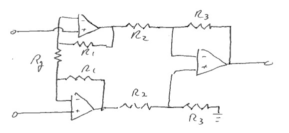
 
<caption>
INA in the traditional configuration has single ended output.
</caption>

The following circuit diagram shows the INA architecture that we want to use for our circuit.
The differential amplifier is replaced with a fully differential amplifier (FDA) and the output from the FDA is interfaced to the differential input of a high performance ADC.
The ADC communicates with the outside world, for example a Teensy board or Arduino, over SPI.

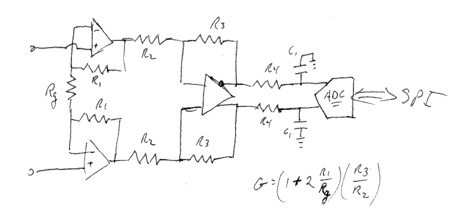
 
<caption>
INA with differential output stage and differential ADC.
</caption>

### b) Component selection, in brief

For our Op Amp selection, key parameters include the input current noise density in, input voltage noise density en, slew rate, and power supply rejection ratio (PSRR) as follows:
<ul>
<li>
Voltage noise density should be in the range of nV/√Hz for 16 bit precision with 1MHz bandwidth.
</li>
<li>
Current noise density in the range of single digit fA/√Hz is a pre-requisite for 16 bit precision with order 10 Mohm input impedance and 1 MHz bandwidth.
</li>
<li>
Slew rate in the range of 10V/us or better is a requirement for being able to study phenomena that appear as steps or transients on a μs time scale.
</li>
<li>
Power supply rejection ratio above 60dB is a requirement for the Op Amp and for the FDA, with the recommended power supply.  This is discussed later in further detail for the ADC.
</li>
</ul>

For the design provided here, the input stage is an ADA4510-2,  which is a dual Op Amp with in = 4fA/√Hz, en ≈ 5nV/√Hz, maximum slew = 19V/μs and PSRR 140dB.
As noted above, at 10Mohms at 1MHz, our noise is 40uV.

For the FDA, all of the above are important except that the current noise requirement is relaxed since the FDA sees low source impedances in the outputs from the first stage.  We choose an LT1994, which exceeds the front end specs with en ≈ 3nV/√Hz and slew at 85V/μs.  Its PSRR is 105dB.

Both the ADA4510 and LT1994 are rail to rail parts.

For the ADC, our requirements include 16bits, 1MSPS, differential inputs, reference voltage, input range to 4V on each side of the differential input, SPI for the interface to the MCU, and it should accommodate 3.3V or 5V logic levels to be able to interface to a wide range of Arduino boards.  The precision and speed puts us in the range of a SAR type ADC.
The flexibility in logic levels narrows the selection somewhat.
It is also important to closely check performance specs including latency, missing codes, SNR, INL and DNL.

In this design we choose the Microchip MCP33131D as a 16 bit differential input 1MSPS SAR type ADC with SPI that can accommodate the required logic levels.
The SNR is listed as 91.3 dB which translates to a noise level of about 1 LSB.
This is one spec where the corresponding TI part might seem marginally better, but it comes at the cost of only accepting 3.3V logic.

For a voltage reference we select the REF3440 which has 3.8uV/V noise, low dropout at 100mV and is recommended for 16bit to 18bit ADCs.

### c) Interfacing to the ADC

SAR type ADCs, like most analog input architectures, feature a switched sampling capacitor.
A simplified version is as follows.
The switch closes connecting the input to the sampling capacitor.
The resistor represents the overall resistance inside the input including the closed resistance of the switch.
The capacitor then charges to the voltage at the input.
The switch opens and the SAR reads the voltage and converts it to a digital representation.

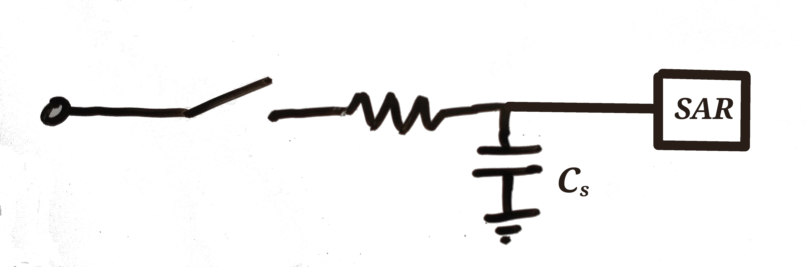

There are two interrelated challenges in driving a switched capacitor network; providing a charge reservoir for the in-rush current when the switch closes, and assuring that the capacitor charges quickly enough or that there is sufficient time in the sampling window, for the sampling capacitor to come within 1 LSB of the input voltage.
The recommended strategy is to provide a charge reservoir in the form of an external capacitor, and a buffer amplifier to charge the reservoir, as follows.

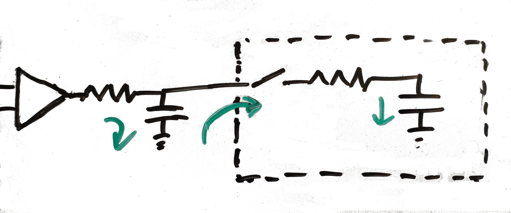

The trick in the above, is that these two capacitors charge on different time scales.
The sampling time allowed for charging the internal sampling capacitor is usually smaller than the period between samples.
The buffer has to supply current on the slower time scale to keep the reservoir charged, but it is the reservoir that absorbs the large fast spike when the switch closes.
   
The design process for the interface to the ADC is then:
   1) Choose the external capacitor to be a few times larger than the internal capacitor, then
   2) Choose the external resistor so that the time constant is faster than 1/2 of the sampling rate, and then
   3) Choose an Op Amp that is (a) able to deliver current equal to the full scale voltage divided by the external resistor, and (b) has a maximum slew that is much larger than the full scale voltage divided by the sampling period.
 
 With that high level view, let's take a look at our ADC.

The datasheet for the MCP33131D ADC provides the following equivalent circuit for its input.

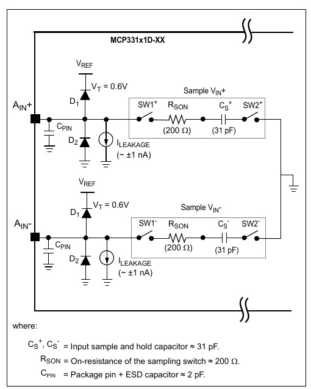

Here we see a switched capacitor network for each side of the differential input.
There seems to be a novelty in that the sampling circuit is represented with a second switch to isolate the capacitor between samples.
Manufacturers often describe the state of the sampling capacitor as "unknown" between sampling events.
Here the intent seems to be a little more specific.
But in actuality there has to be some loss of charge between sampling events even if very small.

In practice, when you model a switched sampling capacitor network in SPICE, you always include a second switch to discharge the capacitor between samples.
If your driving circuit will get the sampling cap to the right voltage within the sampling window coming from 0 each time, it should be okay when you deploy it in the actual device.

Meanwhile, we have some important takeaways from the equivalent circuit.
The capacitor sees a time constant of 6.2 nanoseconds provided there is minimal impedance seen in the driving circuit, and we need something much larger than 30pf in the external capacitor.

---

## 3. SPICE model

For purposes of designing and modeling a circuit to drive an ADC, standard practice as mentioned above, is to use a model similar to the following for the switched sampling capacitor network:

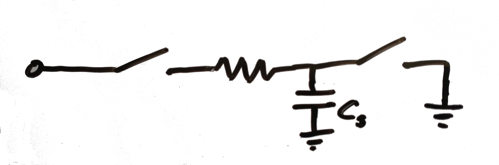

In other words for purposes of modeling the sampling input, we discharge the capacitor between samples. 
A circuit that can drive the sampling cap from 0 to within 1LSB of the input voltage within the sampling period, should be sufficient for any reasonable state of the cap in operation.

The following shows our INA circuit with the equivalent circuit for the sampling input from the datasheet for the ADC.
External to the ADC, on each of the inputs, we have a resistor and capacitor to act as a charge reservoir for the sampling capacitor.
Internal to the ADC sample and hold, we have the switches as shown in the equivalent circuit from the datasheet.
Recall that this ADC isolates the capacitor between sampling windows.

<figure>

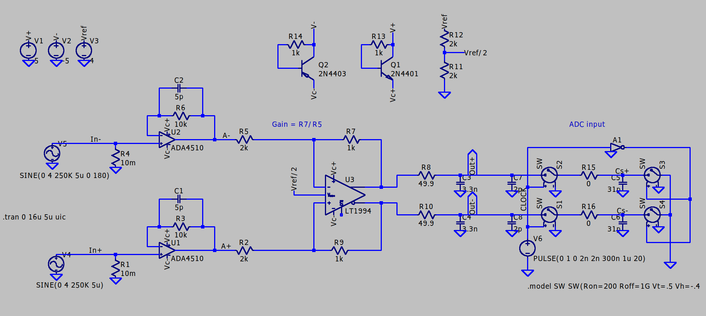
 
<caption>
INA circuit model for SPICE,
</caption>

</figure>

The following shows (a) the voltages at the positive and negative inputs of the two front end amplifiers in two shades of green, and (b) the voltages at the two outputs of the FDA in two shades of blue.
As required for the ADC, the inputs are transformed from a bipolar range from -4V to +4V, to a unipolar range from 0V to 4V.

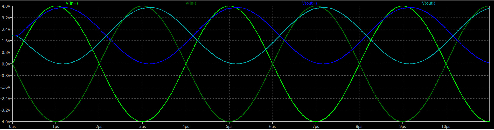
 
<caption>
Voltages at inputs to the front end (green) and at the output
s of the FDA (red and lavender).
</caption>

The following shows (a) the output from one side of the FDA (blue), (b) the voltage on the sampling capacitor (red), (c) switching clock for the sampling network (grey).
We see that voltage on the sampling capacitor easily tracks the input to the ADC.

<figure>

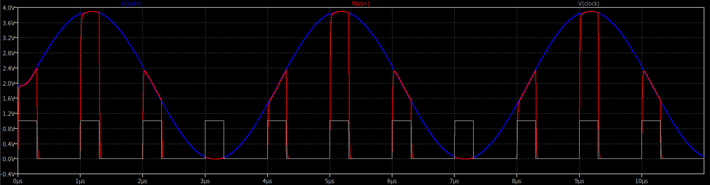

 
<figcaption>
Positive side output from the FDA (blue), voltage on the sampling capacitor (red), and sampling clock (grey).
</figcaption>
</figure>

Here we add traces for the current through the sampling cap (green) and the capacitor services as the external charge reservoir (gold).
Notice the current spike through the sampling capacitor.
We see this is supplied by the external capacitor acting as charge reservoir, which slowly charges between switch events.
Notice also that there is no discernible spike in the output from the FDA.
So the charge reservoir is working as it is supposed.
On each sampling cycle, the sampling capacitor is able to rapidly come to the voltage presented at the input.

<figure>

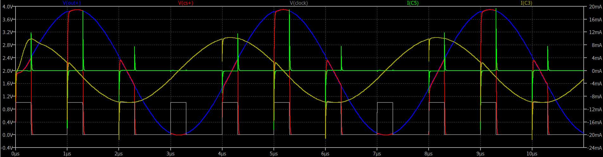

 
<figcaption>
Positive side output from the FDA (blue), voltage on the sampling capacitor (red), current through the sampling capacitor (green), current through the external reservoir capacitor (gold) and the sampling clock (grey).
</figcaption>
</figure>

It is good practice to always check your ADC designs this way.  Find the equivalent circuit in the datasheet and implement it in terms of the capacitances and resistances and make sure you are driving it correctly.

Now, we have two more very important aspects of our circuit design to check, spectral response and noise.
We will look at these at the input to the ADC.
For completeness the following is our SPICE model modified for these analyses with large source impedance on each side of the differential input.

<figure>

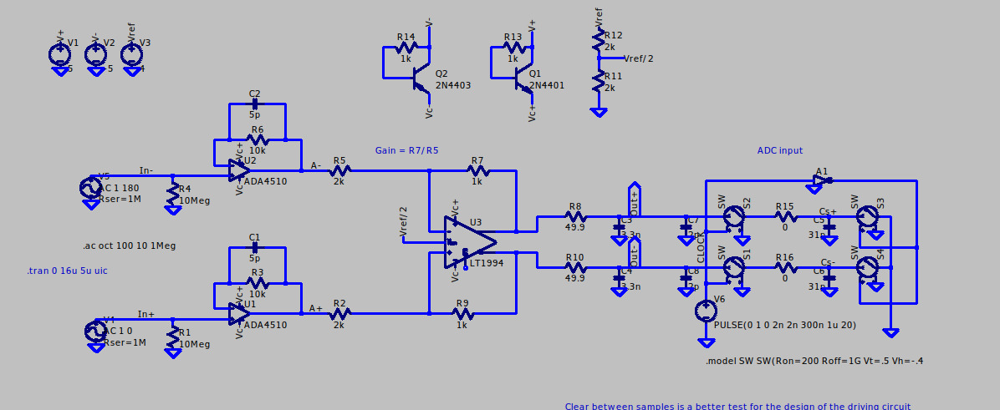

<figcaption align="center">
Spice model with large source impedances.
</figcaption>
</figure>

The following shows the spectral analysis.  If you do not know how to do this in LTSpice, there is [a short tutorial video here](https://youtu.be/fziUQaVQxA4?feature=shared)
Here we see that our response is flat to 100kHz and then rolls off only slowly reaching -1.4dB and a 45 degree phase shift at around 1MHz.
If you want a more aggressive roll off you can substitute the caps in the feedback networks in the front end, or use larger caps for the charge reservoir in front of the ADC.

<figure>

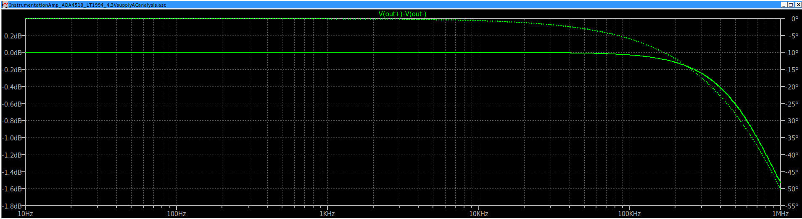

<figcaption align="center">
Spectral response.
</figcaption>
</figure>

The following shows the noise analysis. As above, you can [see how to do this in LTSpice in the short tutorial video here](https://youtu.be/hBsBl27etYs?feature=shared).
https://youtu.be/hBsBl27etYs?feature=shared
 The noise density remains well below our target for 16 bit precision throughout the entire spectral range, even with a 1M source impedance at the input.

<figure>

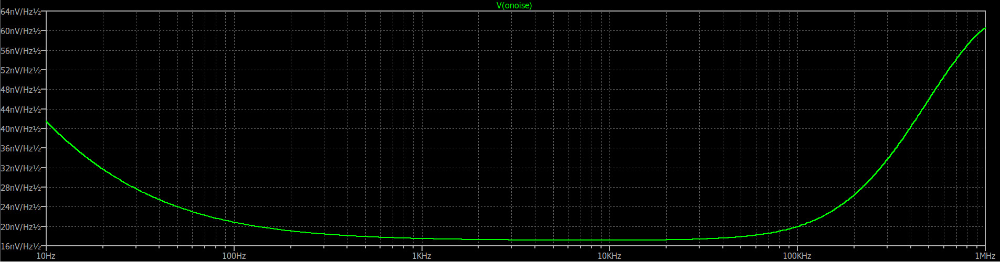

<figcaption align="center">
Noise density.
</figcaption>
</figure>

So, it appears that the design meets our goals,  We expect to be able to make 16 bit 1MSPS measurements with high source impedance.
Spectral response is flat and then rolls off by less than 2dB above 100KHz and noise is under our 120uV requirement throughout the spectral range.

---

## 4. ADC Sampling and Timing

Voltage sampling is controlled by the CNVST pin in the double row header.  Assertion of this pin effectively marks the end of the sampling interval, causes the most recent level at the input to be converted to digital and made available for retrieval by the host.  The timing relationship between CNVST and the sampling window is important if the ADC sampling is to be synchronized to another instrument or specific external events.

The ADC, a MCP33131D-10, is described in detail in the datasheet found [here](https://ww1.microchip.com/downloads/en/DeviceDoc/MCP33131D-Data-Sheet-DS20005947B.pdf).
Figure 6-10, page 37, reproduced below, provides a high level view of the sampling, conversion and transfer cycle.  For detailed timing information see Figure 1-1, page 9 and related text.

In the diagram we see that when the CNVST pin is asserted, the inputs are latched and the ADC begins converting the latched signal, which represents the most 300nsecs at the inputs.  After  700nsecs conversion is complete and the data can be read over SPI by a 16 bit transfer.  The transfer can be shortened by asserting the CNVST pin again before the transfer is complete.  The maximum sample rate is 1MSPS for 16 bit with a 60MHz SPI or 800KSPS with a 30MHz SPI.
The data is a 2's complement 16 bit integer. It is easily converted to an unsigned 16 bit integer by toggling the high order bit.

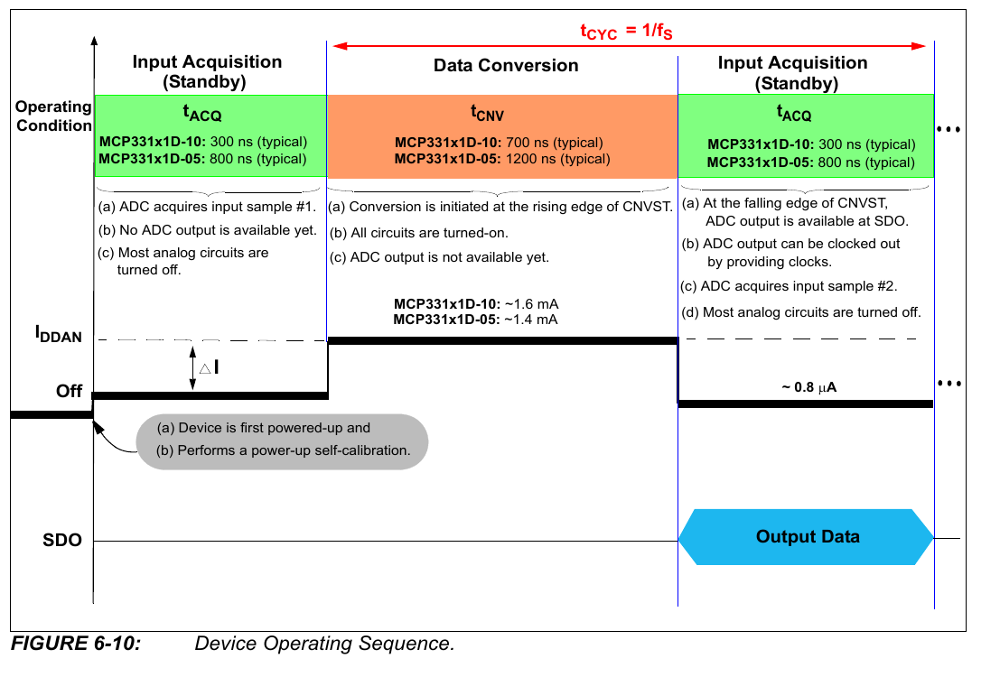

---

## 5. Part selection in more detail

In this section we discuss one of the more important design choices, the input range, and then take a more detailed look at electrical characteristics and part selection.
This may be helpful if you want to modify the design.
Over-designing can present compromises and limitations just as under designing might.
If your requirements are sufficiently different from ours, the part selection process might lead you to a choice that is better for you.

Let's begin.

### a) Choosing the operating range

If we had a specific research goal in mind, we would consider the phenomena we are going to study, set the voltage range accordingly and proceed with the design from there.
Designing for a general case with a spec that reads "I want to use this for anything", is always far more difficult and laden with ambiguities.  A practical spec might be "what is the best we can do?"

As it turns out, 4V can be a convenient range with 5V as the primary power source.
For scientific applications, it is preferable to have a bipolar input, for example -4V to 4V rather than unipolar from 0 to 4V.
If I want to report a measurement as yielding zero volts (0V), most often I have to be able to read voltages above and below 0V.
And, if I want to study a phenomenon over a range that spans 0V, i.e. from negative to positive, then most often I want to do that all in one go, not half at a time.

As described earlier, for an INA any reasonable range is not  very constraining.
We can increase gain to zoom-in to a smaller range or add a series resistor to zoom-out to a larger range.
The bipolar choice has a more significant effect in that any unipolar measurement is inherently half-scale.

### b) What noise level do we need to achieve?

Given that we have chosen 16 bit precision, our noise level should be not very much larger than 1 part in 216 (1LSB) relative to our full scale input.
The ADC will have 1LSB of noise almost no matter what we do, because that's the physics of digitizing something.
Taking 4V as full scale our noise goal is 4V/65535 ~ 61μV at the input to the ADC, or 120μV at the input to the INA.

### c) Input voltage and current noise densities and the impedance bandwidth tradeoff.

As we discussed in the introduction, noise at the input to an Op Amp is described in terms of (a) its input voltage noise density en (V/√Hz)
and (b) its input current noise density in (A/√Hz).
We discussed this in the introduction.

Let's see how this works for the ADA4510.  This is an Op Amp designed for high precision and high input impedance.
The datasheet (Rev 0 is dated 7/2023), lists en ~ 5nV/√Hz and in ~ 4fA/√Hz.
With current noise density in the range of single digit fA/√Hz, our impedance threshold for current noise is 1Mohm,
But the noise is still small.
At 10Mohm and 1MSPS we are still doing well relative to our noise requirement for 16 bit measurements.

For comparison, the popular INA chip, the LT1167 (RevB datasheet dated 2011) has en ~ 7.5nV/√Hz and in ~ 60fA/√Hz above 100Hz.
That puts the impedance threshold at about 100Kohm.
For a large source impedance the LT1167 has to give away a lot of bandwidth compared to what we might expect with a well designed front end based on the ADA4510.

### d) Maximum slew rate and bandwidth

For an Op Amp, speed can be described by its bandwidth or gain bandwidth product (GBP) and by its maximum slew (V/μs)
It is possible to have a very large bandwidth, but be limited by the maximum slew.
For example, the LT1167, can support a gain of 1 with a 1MHZ bandwidth, but its maximum slew is 1.2V/μs.
The ADA4510 has a 10MHz gain bandwidth product, and its maximum slew rate is 19V/μs.
They both seem to have better than 1/2MHz bandwidth, but the ADA4510 can actually slew a full range (-4V to 4V) signal at that speed.

### e) Input capacitance

Looking again at the input characteristics, we might notice that there are two capacitances listed, CINDM the differential mode capacitance, and CINCM the common mode capacitance.a
The following diagram explains the terminology.
You can think of these quantities as the capacitances between the input pins and between each pin and its rail (or AC ground as shown).

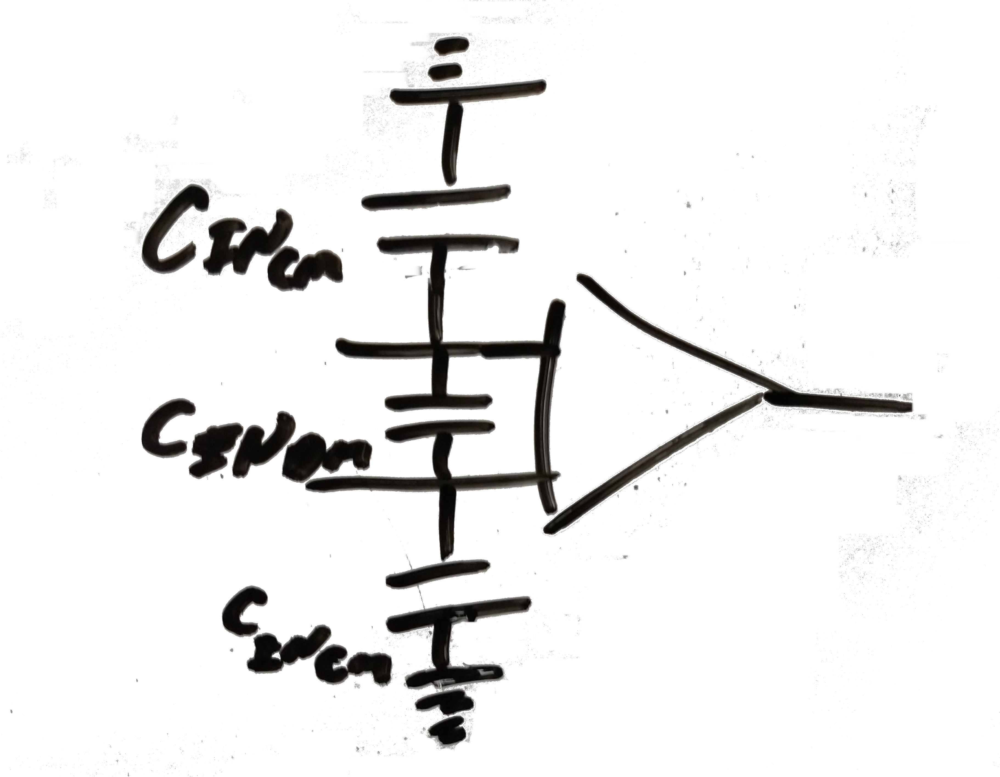

We will mention here that the ADA4510 we have CINDM 20pF and  CINDM = 2pF, and the LT1167 has CINDM 1.6pF and  CINDM = 1.6pF.
But the situation is a little more complicated.
The best way to see what is going on is to run a spice model for the spectral response.
We will show that in a moment.

N.B. When impedances are large, small capacitances become even more important.  Pay careful attention to recommendations in the datasheets about layout around input pins for all of the active parts in the design.

### f) Power supply rejection ratio.

Almost any active part used in an analog circuit has a power supply rejection ratio PSRR listed in its datasheet.
The name of the game, is that the PSRR for each part involved in the analog chain acting on the the noise level of whatever is powering it, has to be better than the noise level that we are trying to achieve in our design.   For a 16 bit board, we need an SNR better than 96dB.

The recommended power supply is posted [here](https://github.com/drmcnelson/Dual-pos-neg-5V-Supply-from-USB-power).
This is based on the LT1930 and LT1930, the datasheets indicate output noise of about 1mV.   For our amplifier chips a PSRR of even 60dB will get us into the μV range that we need for our noise specs. PSRR for the ADA4510 is 140dB, so we're in pretty good shape.
Our FDA an LT1994 has a PSRR of 105dB.  We're still good.

The ADC is an MCP33131D and is powered from a 1.8V LDO TPS72218 with noise level 90μV.
A PSRR at -20dB reduces to 9μV or less than 1LSB in the digital output, and vref is a REF3440 with noise level 3.8μV/V or 16μV, again significantly less than 1LSB.

### g) On rail to rail amplifiers

Our 4V range means that we need an Op Amp and FDA that are rail-to-rail with regard to both inputs and outputs and with a common mode that goes to at least 1/2 of the rail.

Some R-R are more R-R than others.
It is important to check the datasheet carefully to make sure the part you are selecting has adequate input, output and common mode ranges.
Traditional INA are generally not R-R.

Our ADA4510 does go right to the rails (from 0.15V above Vs- all the way to Vs+). 
The LT1994 is also rail to rail in terms of inputs and outputs but its common mode level has to be at least 1 volt from either rail.
That is okay for our case.  We are using the common mode control pin and setting it to the midpoint of the two rails.

---

## 6. Acknowledgement

### Our sponsor - [PCBWay](https://www.pcbway.com/) 

We want to express special appreciation to PCBWay for sponsoring assembly of the first INA boards.  The work product and materials are quite good, and the staff were helpful way above and beyond expectations.  I look forward to working with PCBWay again.

Going back to PCBWay for the next designs and contributing to their community project forum, really is the best kind of praise that I can muster for any vendor.

On that note, we plan to post this design to the PCBWay community forum as our first experiment in this paradigm.  We are eager to see how it works out.
